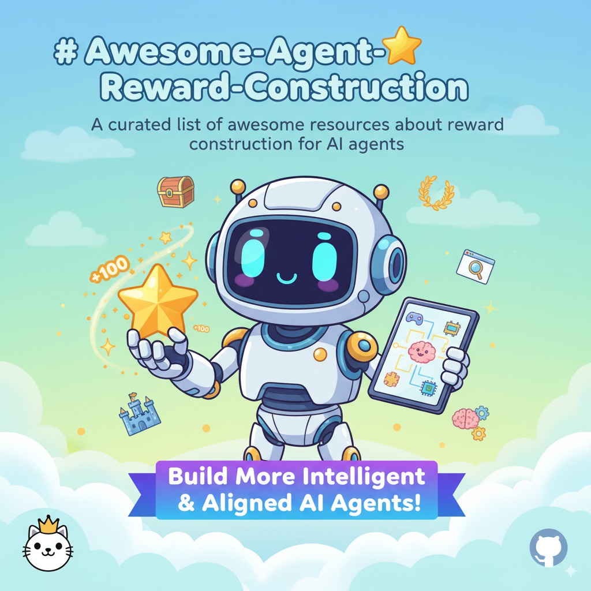

## Awesome-Agent-Reward-Construction



A curated list of awesome resources about reward construction for AI agents. This repository covers cutting-edge research, and practical guides on defining and collecting rewards to build more intelligent and aligned AI agents.

## Table of Contents

- [Introduction](#introduction)
- [Synthesizing Verifiable Task](#verifiable-task-construction)
- [Real-World Task Reward Construction](#real-world-task-reward-construction)
- [Unsupervised Reward Construction](#unsupervised-reward-construction)
- [Reward Model](#reward-model)
- [Evaluation and Benchmarks](#evaluation-and-benchmarks)
- [Contributing](#contributing)


## Introduction

**What is Reward Construction?**

Reward construction is the process of designing and collecting reward signals that guide AI agents toward desired behaviors and outcomes. 

**Why is Reward Construction Important?**

**Background: The Second Half & Era of Experience**

**[The Second Half](https://ysymyth.github.io/The-Second-Half/)**: Transitioning from creating new methods and models to defining new tasks
- **First Half Focus**: Exam-like tasks with universal methods (next token prediction, RL) and architectures (Transformer, GPT)
- **Turning Point**: Organic combination of universal methods and architectures, where RL on large models achieves generalization
- **Second Half Focus**: Project-based scenarios with multi-turn interactions and temporal learning

**[Era of Experience](https://storage.googleapis.com/deepmind-media/Era-of-Experience%20/The%20Era%20of%20Experience%20Paper.pdf)**: Large Models + Reinforcement Learning = General Superhuman Agents
- **Previous Era**: Human Data Era with limitations of human-generated data and capabilities
- **Current Opportunity**: Combining self-discovery capabilities with task generality from the human data era
- **Key Components**: Environmental rewards, autonomous interaction, continuous experience streams, non-human planning and reasoning

In conclusion, reward construction provides **interactive environments** and **learning signals**. It becomes crucial for AI agent to **get experience for new project**. 
We divided Reward Construction research into 5 categories, including **Synthesizing Verifiable Task**, **Real-World Task Reward Construction**, **Unsupervised Reward Construction**, **Reward Model** and **Evaluation and Benchmarks**.

## Synthesizing Verifiable Task

Scaling task quantities through constructing new verifiable task gyms, such as puzzles, games. Training agents to solve these task can enhance model general reasoning capabilities. We divided Reward Construction research to 4 types, including **Multi-Modal Reasoning**, **Text-Based Puzzle Solving**, **Zero-Sum Games**, **Converting Open-Domain Tasks to Verifiable Tasks** and **Curriculum Learning**.

### Multi-Modal Reasoning
- [2505] [](https://github.com/tongjingqi/Code2Logic) [Code2Logic: Game-Code-Driven Data Synthesis for Enhancing VLMs General Reasoning (Fudan University, Douyin Co., Ltd., Shanghai Innovation Institute, Shanghai Key Laboratory of Intelligent Information Processing, Institute of Modern Languages, Fudan University, Southern University of Science and Technology)](https://arxiv.org/abs/2505.13886) - Using game code to synthesize verifiable multi-modal reasoning data for improving VLM general reasoning through RL

- [2506] [](https://github.com/yunfeixie233/ViGaL) [Play to Generalize: Learning to Reason Through Game Play (Rice University, Johns Hopkins University, NVIDIA)](https://arxiv.org/abs/2506.08011) - Training expert models on Snake game to provide ground truth for multi-modal reasoning rewards, improving general reasoning capabilities through RL


### Text-Based Puzzle Solving
- [2508] [](https://github.com/InternLM/InternBootcamp) [InternBootcamp Technical Report: Boosting LLM Reasoning with Verifiable Task Scaling (Shanghai AI Laboratory, Fudan University)](https://arxiv.org/pdf/2508.08636) - Advanced reasoning through structured thinking processes

- [2505] [](https://github.com/MiniMax-AI/SynLogic) [SynLogic: Synthesizing Verifiable Reasoning Data at Scale for Learning Logical Reasoning and Beyond (The Hong Kong University of Science and Technology, MiniMax, The City University of Hong Kong)](https://arxiv.org/abs/2505.19641) - Systematic approach to generating logical reasoning data

- [2505] [](https://github.com/BytedTsinghua-SIA/Enigmata) [Enigmata: Scaling Logical Reasoning in Large Language Models with Synthetic Verifiable Puzzles (ByteDance Seed, Fudan University, Institute for AI Industry Research (AIR), Tsinghua University, Nanjing University, Shanghai Jiao Tong University, SIA-Lab of Tsinghua AIR and ByteDance Seed)](https://arxiv.org/abs/2505.19914) - Creating synthetic puzzles to enhance logical reasoning capabilities

### Zero-Sum Games

- [2506] [](https://github.com/spiral-rl/spiral) [SPIRAL: Self-Play on Zero-Sum Games Incentivizes Reasoning via Multi-Agent Multi-Turn Reinforcement Learning (National University of Singapore, Centre for Frontier AI Research (CFAR), A*STAR, Northeastern University, Sea AI Lab, Plastic Labs, University of Washington)](https://arxiv.org/abs/2506.24119) - Using chess games' natural verifiable environments for self-play with win/loss rewards to enhance general reasoning

### Converting General Tasks to Verifiable Tasks

Transforming general tasks which usually trained through Pretraining and SFT, into RL-compatible formats.

- [2506] [Reinforcement Pre-training (Microsoft Research, Peking University, Tsinghua University)](https://arxiv.org/abs/2506.08007) - Converting next token prediction tasks into verifiable rewards where the next token serves as the verification signal

- [2503] [](https://github.com/Alex-Gurung/ReasoningNCP) [Learning to Reason for Long-Form Story Generation (University of Edinburgh)](https://arxiv.org/abs/2503.22828) - Constructing next chapter prediction tasks for story generation, using subsequent chapters as ground truth for reward construction

- [2506] [](https://github.com/OpenBMB/RLPR) [RLPR: Extrapolating RLVR to General Domains without Verifiers (Tsinghua University, National University of Singapore, Shanghai Qi Zhi Institute, Harbin Institute of Technology, Beijing University of Posts and Telecommunications, University of Illinois Urbana-Champaign)](https://arxiv.org/abs/2506.18254) - Extending reinforcement learning from verifiable reasoning to general domains

- [2505] [](https://github.com/sail-sg/VeriFree) [Reinforcing General Reasoning without Verifiers (Sea AI Lab, Singapore, University of Chinese Academy of Sciences, Institute of Automation, Chinese Academy of Sciences, National University of Singapore, University of Oxford, Renmin University of China)](https://arxiv.org/abs/2505.21493) - General reasoning enhancement without explicit verification mechanisms

### Curriculum Learning

Scaling difficuity of task through curriculum learning, converting sparse reward to dense reward.
- [2507] [Blending Supervised and Reinforcement Fine-Tuning with Prefix Sampling (University of Edinburgh, Fudan University, Alibaba Group, University of Amsterdam, Stepfun)](https://arxiv.org/abs/2507.01679) - The paper introduces Prefix-RFT, a hybrid approach that combines Supervised Fine-Tuning and Reinforcement Fine-Tuning to enhance AI agent performance by synergizing learning from demonstration and exploration, particularly effective in mathematical reasoning tasks.

- [2402] [](https://github.com/WooooDyy/LLM-Reverse-Curriculum-RL) [Training Large Language Models for Reasoning through Reverse Curriculum Reinforcement Learning (Fudan University, ByteDance Research)](https://arxiv.org/pdf/2402.05808) - The paper introduces R³, a method that uses reverse curriculum reinforcement learning to transform sparse outcome supervision into step-level supervisory signals, enhancing reasoning in large language models without requiring extensive manual annotations.

- [2405] [](https://github.com/StoneT2000/rfcl) [Reverse Forward Curriculum Learning for Extreme Sample and Demonstration Efficiency in Reinforcement Learning (University of California, San Diego)](https://arxiv.org/pdf/2405.03379) - The paper introduces the Reverse Forward Curriculum Learning (RFCL) algorithm, which enhances reward construction for AI agents by leveraging a reverse curriculum to train an initial policy on a narrow state distribution and a forward curriculum to generalize it, significantly improving demonstration and sample efficiency without relying on engineered dense reward signals.

- [2505] [](https://github.com/liumy2010/UFT) [UFT: Unifying Supervised and Reinforcement Fine-Tuning (Massachusetts Institute of Technology)](https://arxiv.org/pdf/2505.16984) - The paper introduces Unified Fine-Tuning (UFT), which integrates supervision from SFT and reward from RFT into a single training paradigm, blending reward optimization with log-likelihood maximization on hints to enable simultaneous exploration and learning, addressing the trade-off between memorization and generalization.

## Real-World Task Reward Construction

Design reward function and synthesis data to scale up the quantities of the real-world reward. We divided Real-World Task Reward Construction research into 4 types, including **Web Search**, **GUI**, **VLA** and **World Model**.

### Web Search
- [2505] [](https://github.com/Alibaba-NLP/WebAgent) [WebDancer: Towards Autonomous Information Seeking Agency (Tongyi Lab, Alibaba Group)](https://arxiv.org/abs/2505.22648) - Synthesizing agent action trajectories for search tasks, constructing verifiable QA pairs for RL training on information seeking
  
- [2507] [](https://github.com/Alibaba-NLP/WebAgent) [WebSailor: Navigating Super-human Reasoning for Web Agent (Tongyi Lab, Alibaba Group)](https://arxiv.org/pdf/2507.02592) - The paper's main contribution is the development of WebSailor, a post-training methodology that enhances AI agents' reward construction by generating high-uncertainty tasks and using an efficient RL algorithm, Duplicating Sampling Policy Optimization (DUPO), to match proprietary agents' performance in complex information-seeking tasks.

- [2507] [](https://github.com/Alibaba-NLP/WebAgent) [WebShaper: Agentically Data Synthesizing via Information-Seeking Formalization (Tongyi Lab, Alibaba Group)](https://arxiv.org/pdf/2507.15061) - Formalization-driven data synthesis framework for information-seeking tasks.

- [2508] [](https://github.com/Alibaba-NLP/WebAgent) [WebWatcher: Breaking New Frontiers of Vision-Language Deep Research Agent (Tongyi Lab, Alibaba Group)](https://arxiv.org/pdf/2508.05748) - The paper's main contribution regarding reward construction for AI agents is the development of a reinforcement learning approach using Group-Relative Policy Optimization (GRPO) with a reward function that balances format conformance and semantic accuracy, enhancing decision-making for multimodal deep research tasks.
  
- [2503] [](https://github.com/PeterGriffinJin/Search-R1) [Search-R1: Training LLMs to Reason and Leverage Search Engines with Reinforcement Learning (University of Illinois at Urbana-Champaign, University of Massachusetts Amherst, Google Cloud AI Research)](https://arxiv.org/abs/2503.09516) - Search-R1 introduces a reinforcement learning approach that enables large language models to autonomously generate search queries during reasoning, using a simple outcome-based reward function to optimize multi-turn search interactions.

- [2408] [](https://github.com/sentient-engineering/agent-q) [Agent Q: Advanced Reasoning and Learning for Autonomous AI Agents (The AGI Company (MultiOn), Stanford University)](https://arxiv.org/pdf/2408.07199) - Combination of DPO, MCTS, and process supervision for web navigation tasks with multi-modal reasoning rewards

- [2411] [](https://github.com/THUDM/WebRL) [WebRL: Training LLM Web Agents via Self-Evolving Online Curriculum Reinforcement Learning (Tsinghua University, Zhipu AI)](https://arxiv.org/pdf/2411.02337) - The paper introduces a robust outcome-supervised reward model (ORM) within the WEB RL framework to evaluate task success and provide binary reward signals, addressing the sparsity and cost of feedback signals in training LLM-based web agents.
  
- [2508] [](https://github.com/inclusionAI/ASearcher) [Beyond Ten Turns: Unlocking Long-Horizon Agentic Search with Large-Scale Asynchronous RL (IIIS, Tsinghua University, Ant Research, RL Lab, University of Washington)](https://arxiv.org/pdf/2508.07976) - The paper introduces ASearcher, which employs a sparse-reward setting where rewards are computed at trajectory completion, using a combination of format reward and F1 score for base LLMs and LLM-as-Judge for fine-tuning large reasoning models, to enhance search intelligence in AI agents through reinforcement learning.
  
- [2504] [](https://github.com/RUC-NLPIR/WebThinker) [WebThinker: Empowering Large Reasoning Models with Deep Research Capability (Renmin University of China, BAAI, Huawei Poisson Lab)](https://arxiv.org/pdf/2504.21776) - The paper introduces an RL-based training strategy using iterative online Direct Preference Optimization (DPO) to enhance large reasoning models' ability to effectively utilize research tools by constructing preference pairs based on accuracy, tool usage, and output quality from sampled reasoning trajectories.

### GUI

- [2506] [](https://github.com/OpenBMB/AgentCPM-GUI) [AgentCPM-GUI: Building Mobile-Use Agents with Reinforcement Fine-Tuning (Tsinghua University, Renmin University of China, ModelBest Inc.)](https://arxiv.org/pdf/2506.01391) - The paper's main contribution is the development of a reinforcement fine-tuning stage using Group Relative Policy Optimization (GRPO) to enhance the reasoning and decision-making capabilities of AgentCPM-GUI, enabling robust performance on complex, long-horizon GUI tasks.

- [2505] [](https://github.com/dvlab-research/ARPO) [ARPO:End-to-End Policy Optimization for GUI Agents with Experience Replay (The Chinese University of Hong Kong, SmartMore, Hong Kong University of Science and Technology)](https://arxiv.org/pdf/2505.16282) - The paper's main contribution is the introduction of Agentic Replay Policy Optimization (ARPO), which enhances reward construction for AI agents by integrating a replay buffer with Group Relative Policy Optimization to reuse successful experiences and stabilize training in sparse-reward GUI environments.

- [2504] [](https://github.com/ritzz-ai/GUI-R1) [GUI-R1: A Generalist R1-Style Vision-Language Action Model For GUI Agents (Shenzhen Institute of Advanced Technology, Chinese Academy of Sciences, University of Chinese Academy of Sciences, National University of Singapore)](https://arxiv.org/pdf/2504.10458) - The paper introduces GUI-R1, which designs a rule-based unified action space reward function to evaluate and enhance the accuracy of predicted GUI actions across different platforms and task granularities, improving the performance of large vision-language models with significantly less data.

- [2412] [](https://github.com/OS-Copilot/OS-Genesis) [OS-Genesis: Automating GUI Agent Trajectory Construction via Reverse Task Synthesis (Shanghai AI Laboratory, The University of Hong Kong, Johns Hopkins University, Shanghai Jiao Tong University, University of Oxford, Hong Kong University of Science and Technology)](https://arxiv.org/pdf/2412.19723) - The paper introduces a Trajectory Reward Model (TRM) in the OS-Genesis pipeline, which uses a graded evaluation with scores from 1 to 5 to assess trajectory quality based on completion and coherence, enhancing the training of GUI agents by effectively utilizing both complete and incomplete trajectories.

- [2506] [](https://github.com/sunblaze-ucb/AgentSynth) [AgentSynth: Scalable Task Generation for Generalist Computer-Use Agents (UC Berkeley)](https://arxiv.org/abs/2506.14205) - AgentSynth's main contribution is a scalable and cost-efficient pipeline that automatically synthesizes diverse and realistic tasks for generalist computer-use agents by leveraging information asymmetry to create challenging long-horizon tasks from simple subtasks.
  
### Embodied AI & Vision-Language-Action Model

- [2505] [](https://github.com/GuanxingLu/vlarl) [VLA-RL: Towards Masterful and General Robotic Manipulation with Scalable Reinforcement Learning (Tsinghua Shenzhen International Graduate School, Tsinghua University, School of Electrical and Electronic Engineering, Nanyang Technological University)](https://arxiv.org/abs/2505.18719) -  Reward design in embodied AI systems
  
- [2501] [Improving vision-language-action model with online reinforcement learning (Institute for Interdisciplinary Information Sciences, Tsinghua University, Shanghai Qi Zhi Institute, University of California, Berkeley)](https://arxiv.org/pdf/2501.16664) - The paper introduces the iRe-VLA framework, which enhances reward construction for AI agents by iterating between reinforcement learning and supervised learning to stabilize training and improve performance in vision-language-action models for robotic control.

- [2505] [](https://github.com/gen-robot/RL4VLA) [What Can RL Bring to VLA Generalization? (Tsinghua University, Shanghai Qi Zhi Institute, Beijing Zhongguancun Academy)](https://arxiv.org/pdf/2505.19789) - The paper's main contribution is developing an efficient PPO-based RL fine-tuning recipe that significantly enhances VLA generalization in semantic understanding and execution robustness compared to SFT, while maintaining comparable visual robustness.

- [2505] [](https://github.com/Ariostgx/ript-vla) [Interactive Post-Training for Vision-Language-Action Models (UT Austin, Nankai University)](https://arxiv.org/pdf/2505.17016) - RIPT-VLA's main contribution is a reinforcement learning paradigm that fine-tunes pretrained Vision-Language-Action models using only sparse binary success rewards, enabling stable and data-efficient optimization without the need for shaped rewards, value functions, or reward modeling.

### World Model 
Towards future: Using world models and real-world interactions for reward construction.

- [2508] [Genie 3: A new frontier for world models (Google DeepMind)](https://deepmind.google/discover/blog/genie-3-a-new-frontier-for-world-models/) - Genie 3 introduces a general purpose world model that enhances AI agent training by generating consistent, interactive, and promptable environments, allowing for longer sequences of actions and more complex goal achievement through real-time navigation and text-based world event modifications.
  
- [2508] [](https://github.com/SkyworkAI/Matrix-Game) [Matrix-Game 2.0: An Open-Source, Real-Time, andStreaming Interactive World Model (Skywork AI)](https://arxiv.org/pdf/2508.13009) - Matrix-Game 2.0 for real-time interactive video generation

- [2406] [](https://github.com/cognitiveailab/GPT-simulator) [Can Language Models Serve as Text-Based World Simulators? (University of Arizona, New York University, Johns Hopkins University, Microsoft Research Montréal, Allen Institute for AI)](https://arxiv.org/abs/2406.06485) - Exploring LLMs as world simulators for reward construction

## Unsupervised Reward Construction

Finding reward signals from model internals. Model generates data to train itself. We divided Unsupervised Reward Construction into 2 types, including Proposer and Solver and the discussion of can Large Reasoning Models Self-Train.

### Proposer and Solver 

Models simultaneously act as problem proposers and solution generators, creating new training data.

- [2505] [Absolute Zero: Reinforced Self-play Reasoning with Zero Data (Tsinghua University, Beijing Institute for General Artificial Intelligence, Pennsylvania State University)](https://arxiv.org/abs/2505.03335) - Models serving dual roles as problem proposers and solvers, using compiler verification for self-improvement without external data

- [2508] [R-Zero: Self-Evolving Reasoning LLM from Zero Data (Tencent AI Seattle Lab, Washington University in St. Louis, University of Maryland, College Park, The University of Texas at Dallas)](https://arxiv.org/abs/2508.05004) - R-Zero's main contribution is introducing a fully autonomous framework where a Challenger and a Solver LLM co-evolve through interaction, with rewards based on proposing and solving increasingly challenging tasks, respectively, to improve reasoning capabilities without relying on pre-existing human-curated data.

- [2508] [Self-Questioning Language Models (Carnegie Mellon University)](https://arxiv.org/pdf/2508.03682) - The paper introduces Self-Questioning Language Models (SQLM), an asymmetric self-play framework where AI agents improve reasoning skills by generating and solving their own questions, using reinforcement learning with rewards based on problem difficulty and majority voting or unit tests for verification, without needing curated training data.

### Internal Signal Mining
Extracting learning signals from model internals, confidence scores, and consistant behaviors without external validation or verification mechanisms.

- [2505] [](https://github.com/PRIME-RL/Entropy-Mechanism-of-RL) [The Entropy Mechanism of Reinforcement Learning for Reasoning Language Models (Shanghai AI Laboratory, Tsinghua University, UIUC, Peking University, Nanjing University, CUHK)](https://arxiv.org/abs/2505.22617) - Understanding how entropy affects reinforcement learning in reasoning models, it indicated that the improvement of self-train may cause by the entropy mechanism.

- [2506] [](https://github.com/ruixin31/Spurious_Rewards) [Spurious Rewards: Rethinking Training Signals in RLVR (University of Washington, Allen Institute for Artificial Intelligence, University of California, Berkeley)](https://arxiv.org/abs/2506.10947) - Can random reward improve model performance?

- [2505] [](https://github.com/zitian-gao/one-shot-em) [Can Large Reasoning Models Self-Train (Ubiquant)](https://arxiv.org/abs/2505.20282) - The paper's main contribution is demonstrating that entropy minimization with a single unlabeled data point and 10 optimization steps can achieve performance improvements comparable to or better than traditional methods using thousands of data points and carefully designed rewards in rule-based reinforcement learning for AI agents.

- [2504] [](https://github.com/PRIME-RL/TTRL) [TTRL: Test-Time Reinforcement Learning (Tsinghua University, Shanghai AI Lab)](https://arxiv.org/abs/2504.16084) - The paper introduces Test-Time Reinforcement Learning (TTRL), a novel method that uses majority voting from Test-Time Scaling to construct effective rewards for training Large Language Models on unlabeled data, enabling significant performance improvements.

- [2505] [](https://github.com/sail-sg/VeriFree) [Enhancing Reasoning Ability through RL without Labels (Sea AI Lab, Singapore, University of Chinese Academy of Sciences, Institute of Automation, Chinese Academy of Sciences, National University of Singapore, University of Oxford, Renmin University of China)](https://arxiv.org/abs/2505.21493) - Completely unsupervised methods for reasoning enhancement

- [2505] [](https://github.com/sunblaze-ucb/Intuitor) [Maximizing Confidence Alone Improves Reasoning (Carnegie Mellon University)](https://arxiv.org/abs/2505.22660) - The paper introduces RENT, a fully unsupervised reinforcement learning method that uses a model's entropy as an intrinsic reward to improve reasoning by reinforcing chains of thought with high model confidence, eliminating the need for external rewards or ground-truth answers.

- [2505] [](https://github.com/sail-sg/VeriFree) [VeriFree: Reinforcing General Reasoning without Verifiers (Sea AI Lab, Singapore, University of Chinese Academy of Sciences, Institute of Automation, Chinese Academy of Sciences, National University of Singapore, University of Oxford, Renmin University of China)](https://arxiv.org/abs/2505.21493)

- [2504] [](https://github.com/QingyangZhang/EMPO) [Right Question is Already Half the Answer: Fully Unsupervised LLM Reasoning Incentivization (Tianjin University, Tencent AI Lab, NUS)](https://arxiv.org/abs/2504.05812) - The paper introduces Entropy Minimized Policy Optimization, a fully unsupervised method that enhances large language model reasoning by minimizing predictive entropy on unlabeled questions, achieving competitive performance without supervised signals.

- [2505] [](https://github.com/sunblaze-ucb/Intuitor) [Learning to Reason without External Rewards (UC Berkeley, Yale University)](https://arxiv.org/abs/2505.19590) - The paper introduces Intuitor, a method that uses a model's self-certainty as an intrinsic reward signal for unsupervised reinforcement learning, enabling effective reasoning and generalization without external rewards.
  
## Reward Model Construction

Scaling preference data for reward models training to enable policy learning on general tasks.

### Generative Reward Model
- [2504] [Inference-Time Scaling for Generalist Reward Modeling (DeepSeek-AI, Dept. of Computer Sci. & Tech., Tsinghua University, Institute for AI Industry Research (AIR), Tsinghua University)](https://arxiv.org/abs/2504.02495) - The paper's main contribution is the development of Self-Principled Critique Tuning (SPCT) to enhance the inference-time scalability and quality of generalist reward modeling for AI agents using pointwise generative reward modeling and online reinforcement learning.
  
- [2410] [Generative Reward Models (SynthLabs, Stanford University)](https://arxiv.org/pdf/2410.12832) - The paper's main contribution is the introduction of GenRM, an iterative algorithm that trains LLMs on self-generated reasoning traces to create synthetic preference labels that align with human judgments, enhancing reward construction for AI agents by improving both in-distribution accuracy and out-of-distribution generalization compared to traditional methods.

- [2408] [Generative Verifiers: Reward Modeling as Next-Token Prediction (Google DeepMind, University of Toronto, Mila, UCLA, Carnegie Mellon University)](https://arxiv.org/pdf/2408.15240) - The paper introduces Generative Verifiers (GenRM), which reformulate reward modeling as next-token prediction, leveraging LLMs' text generation capabilities to enhance verification performance through chain-of-thought reasoning and majority voting, outperforming traditional discriminative verifiers.

### Reward Model Pretrain
- [2505] [](https://github.com/QwenLM/WorldPM) [WorldPM: Scaling Human Preference Modeling (Qwen Team, Alibaba Group, Fudan University)](https://arxiv.org/abs/2505.10527) - Exploring scalability of preference modeling using 15M human forum data, showing clear scaling laws in objective tasks like mathematics
  
- [2507] [](https://github.com/InternLM/POLAR) [POLAR：Pre-Trained Policy Discriminators are General Reward Models (Shanghai AI Laboratory, Fudan University)](https://arxiv.org/pdf/2507.05197) - The paper introduces POLAR, a novel criterion-agnostic pre-training paradigm for reward modeling that uses policy discrimination to enhance scalability and generalization, significantly outperforming traditional methods in reward signal accuracy and policy performance.
  
### Multi-Modal Reward Models  
- [2505] [](https://github.com/jishengpeng/WavReward) [WavReward: Spoken Dialogue Models With Generalist Reward Evaluators (Zhejiang University, Alibaba Group)](https://arxiv.org/abs/2505.09558) - Reward evaluation for spoken dialogue systems
  
- [2312] [Vision-Language Models as a Source of Rewards (Google DeepMind)](https://arxiv.org/abs/2312.09187) - The paper demonstrates that off-the-shelf vision-language models, specifically from the CLIP family, can be used as a source of rewards to train reinforcement learning agents capable of achieving a variety of language-specified visual goals.
  
- [2402] [Code as Reward: Empowering Reinforcement Learning with VLMs (Mila, McGill University, Google DeepMind, University of California, Berkeley)](https://arxiv.org/abs/2402.04764) - The paper introduces the Code as Reward (VLM-CaR) framework, which generates dense and accurate reward functions for reinforcement learning agents by leveraging Vision-Language Models through code generation, reducing computational costs compared to direct VLM querying.
  
- [2402] [](https://github.com/yufeiwang63/RL-VLM-F) [RL-VLM-F: Reinforcement Learning from Vision Language Foundation Model Feedback (Robotics Institute, Carnegie Mellon University, Department of Computer Science, University of Southern California)](https://arxiv.org/abs/2402.03681) - RL-VLM-F introduces a method that automatically generates reward functions for AI agents by leveraging feedback from vision language foundation models, using task goal descriptions and visual observations to learn rewards from preference labels rather than raw scores.
  

### Process Supervision

- [2507] [Dynamic and Generalizable Process Reward Modeling (College of Computer Science and Artificial Intelligence, Fudan University, The University of Hong Kong)](https://arxiv.org/pdf/2507.17849) - The paper introduces Dynamic and Generalizable Process Reward Modeling (DG-PRM), which uses a reward tree and Pareto dominance estimation to dynamically construct and allocate fine-grained, multi-dimensional process rewards, enhancing AI agent performance and generalizability across diverse tasks.
  
- [2501] [The Lessons of Developing Process Reward Models in Mathematical Reasoning (Alibaba Group)](https://arxiv.org/abs/2501.07301) - Supervising intermediate reasoning steps rather than just final outcomes
  
- [2312] [](https://github.com/openreasoner/openr) [Math-Shepherd: Verify and Reinforce LLMs Step-by-step without Human Annotations (National Key Laboratory for Multimedia Information Processing, Peking University, DeepSeek-AI, The University of Hong Kong, Tsinghua University, The Ohio State University)](https://arxiv.org/abs/2312.08935) - The paper introduces Math-Shepherd, a process-oriented reward model that assigns scores to each step of math problem solutions using automatically constructed supervision data, enhancing the performance of LLMs in verification and reinforcement learning without relying on human annotations.
  
- [2305] [](https://github.com/openai/prm800k) [Let’s Verify Step by Step (OpenAI)](https://arxiv.org/pdf/2305.20050) - The paper demonstrates that process supervision, which provides feedback for each intermediate reasoning step, significantly outperforms outcome supervision in training reliable reward models for AI agents solving mathematical problems, achieving a 78% solve rate on a subset of the MATH test set.

## Evaluation and Benchmarks

Providing benchmarks or gyms to evaluate the model proformance. We divided Evaluation and Benchmarks into 4 types: Reward Model Benchmarks, Game Gym, Web Search, Computer Use and New Evaluation Dimension.

### Reward Model Benchmarks
- [2403] [](https://github.com/allenai/reward-bench) [RewardBench (Allen Institute for Artificial Intelligence, University of Washington, Berkman Klein Center, Harvard Law)](https://arxiv.org/abs/2403.13787) - Comprehensive benchmark for reward model evaluation

- [2411] [](https://github.com/vl-rewardbench/VL_RewardBench) [VL-RewardBench (HKU, SCUT, SJTU, PKU, UW, Allen AI)](https://arxiv.org/abs/2411.17451) - Vision-language reward model benchmarking

- [2501] [](https://github.com/ssmisya/PRMBench) [PRMBench: A Fine-grained and Challenging Benchmark for Process-Level Reward Models (Fudan University, Shanghai AI Laboratory, Soochow University, Stony Brook University, The Chinese University of Hong Kong)](https://arxiv.org/pdf/2501.03124) - The paper introduces PRMBENCH, a comprehensive benchmark with 6,216 samples and 83,456 step-level labels, to evaluate the fine-grained error detection capabilities of Process-level Reward Models (PRMs) across dimensions like simplicity, soundness, and sensitivity, revealing significant weaknesses in current models and guiding future research.

- [2412] [](https://github.com/QwenLM/ProcessBench) [PROCESSBENCH (Alibaba Inc.)](https://arxiv.org/pdf/2412.06559) - The paper introduces PROCESSBENCH, a benchmark for evaluating the ability of process reward models (PRMs) and critic models to identify errors in mathematical reasoning, revealing that existing PRMs struggle to generalize to challenging problems and underperform compared to critic models and a newly fine-tuned PRM on the PRM800K dataset.

### Game Gym
  
- [2402] [](https://github.com/jinhaoduan/GTBench) [GTBench: Uncovering the strategic reasoning limitations of llms via game-theoretic evaluations (Drexel University, Boston University, LLNL, Lehigh University, UNC Chapel Hill, MIT, Harvard University)](https://arxiv.org/abs/2402.12348) - The paper introduces GTBench, a language-driven environment with 10 game-theoretic tasks, to evaluate and characterize the strategic reasoning limitations of LLMs in competitive scenarios, highlighting their performance across different game types and the impact of code-pretraining on strategic reasoning.
  
- [2412] [](https://github.com/lmgame-org/GamingAgent) [GameArena: Evaluating LLM Reasoning through Live Computer Games (University of California, San Diego, University of California, Berkeley)](https://arxiv.org/abs/2412.06394) - The paper does not discuss reward construction for AI agents, so no summary can be provided for this specific aspect.
  
- [2403] [](https://github.com/CUHK-ARISE/GAMABench) [How Far Are We on the Decision-Making of LLMs? Evaluating LLMs’ Gaming Ability in Multi-Agent Environments (The Chinese University of Hong Kong, Tencent AI Lab, The Chinese University of Hong Kong, Shenzhen, Tsinghua University)](https://arxiv.org/abs/2403.11807) - The paper introduces GAMA($\gamma$)-Bench, a new framework with a dynamic scoring scheme to evaluate LLMs' gaming ability in multi-agent environments, enhancing the assessment of robustness and generalizability.
  
- [2411] [](https://github.com/balrog-ai/BALROG) [Balrog: Benchmarking agentic llm and vlm reasoning on games (AI Centre, University College London, IDEAS NCBR, University of Warsaw, University of Oxford, New York University, Anthropic, Institute of Mathematics, Polish Academy of Sciences)](https://arxiv.org/abs/2411.13543) - A benchmark for evaluating the agentic capabilities of LLMs and VLMs in game environments.

- [2505] [](https://github.com/OS-Copilot/ScienceBoard) [ScienceBoard: Evaluating Multimodal Autonomous Agents in Realistic Scientific Workflows (The University of Hong Kong, Shanghai AI Laboratory, Fudan University, Peking University, Nanjing University, East China Normal University, Yale University)](https://arxiv.org/pdf/2505.19897) - Evaluating multimodal autonomous agents in scientific workflows through the SCIENCE BOARD environment and benchmark.

- [2406] [](https://github.com/Joshuaclymer/GameBench) [GameBench: Evaluating strategic reasoning abilities of llm agents (Olin College of Engineering, University of Texas at Dallas, University of Oxford, University College London, ShanghaiTech University, Columbia University, University of Manchester)](https://arxiv.org/abs/2406.06613) - The paper introduces GameBench, a cross-domain benchmark to evaluate the strategic reasoning abilities of LLM agents across 9 game environments, focusing on reasoning skills not heavily represented in pretraining data, and tests enhancements like Chain-of-Thought and Reasoning Via Planning.

### Web Search Evaluation

- [2311] [GAIA: a benchmark for General AI Assistants (FAIR, Meta, HuggingFace, AutoGPT, GenAI, Meta)](https://arxiv.org/abs/2311.12983) - The paper introduces GAIA, a benchmark designed to evaluate AI assistants on real-world questions requiring fundamental abilities like reasoning and tool-use, highlighting the gap between human and AI performance to guide the development of more robust AI systems.
  
- [2504] [](https://github.com/openai/simple-evals) [BrowseComp: A Simple Yet Challenging Benchmark for Browsing Agents (OpenAI)](https://arxiv.org/abs/2504.12516) - The paper introduces BrowseComp, a benchmark designed to evaluate the persistence and creativity of browsing agents in navigating the web to find hard-to-find information, analogous to programming competitions for coding agents.
  
- [2504] [](https://github.com/PALIN2018/BrowseComp-ZH) [BrowseComp-ZH: Benchmarking Web Browsing Ability of Large Language Models in Chinese (Hong Kong University of Science and Technology (Guangzhou), Peking University, Mindverse AI, Alibaba Group, Zhejiang University, Zhejiang University of Technology, MBZUAI, NIO, HSBC, Harvard T.H. Chan School of Public Health)](https://arxiv.org/abs/2504.19314) - The paper introduces BrowseComp-ZH, a benchmark to evaluate the web browsing ability of large language models in Chinese, highlighting the challenges in retrieval and reasoning for these models in a linguistically and infrastructurally complex environment.
  
### Computer Use Evaluation
- [2406] [](https://github.com/sierra-research/tau-bench) [τ-bench: A Benchmark for Tool-Agent-User Interaction in Real-World Domains (Mila – Quebec AI Research Institute, Polytechnique Montréal)](https://arxiv.org/pdf/2406.12045) - The paper introduces a reward system for AI agents in τ-bench that evaluates success based on whether the final database state matches the unique ground truth outcome and whether the agent's responses contain all necessary information, ensuring faithful and fast evaluation.

- [2404] [](https://github.com/xlang-ai/OSWorld) [OSWORLD: Benchmarking Multimodal Agents for Open-Ended Tasks in Real Computer Environments (The University of Hong Kong, CMU, Salesforce Research, University of Waterloo)](https://arxiv.org/pdf/2404.07972) - The paper introduces an execution-based reward function in the OSWORLD environment that awards a value of 1 or a positive decimal under 1 at the final step if the state transitions meet the task objective, or 0 otherwise, to evaluate AI agents' performance on real computer tasks.
  
- [2412] [](https://github.com/TheAgentCompany/TheAgentCompany) [TheAgentCompany: Benchmarking LLM Agents on Consequential Real World Tasks (Carnegie Mellon University, Duke University)](https://arxiv.org/abs/2412.14161) - A benchmark for evaluating LLM agents on real-world professional tasks.
  
- [2403] [](https://github.com/ServiceNow/WorkArena) [WorkArena: How Capable Are Web Agents at Solving Common Knowledge Work Tasks? (ServiceNow Research, Mila – Quebec AI Research Institute, Polytechnique Montréal, McGill University, Université de Montréal)](https://arxiv.org/abs/2403.07718) - The paper introduces WorkArena and BrowserGym to evaluate and design large language model-based agents for web-based knowledge work tasks, highlighting their current limitations and performance disparities between open and closed-source models.

- [2504] [](https://github.com/openai/simple-evals) [BrowseComp: A Simple Yet Challenging Benchmark for Browsing Agents (OpenAI)](https://arxiv.org/abs/2504.12516) - The paper introduces BrowseComp, a benchmark designed to evaluate the persistence and creativity of browsing agents in navigating the web to find hard-to-find information, without focusing on reward construction.


## Limitation and Future Work

- Game data isn't utilized thoroughly. Games are shown effective to enhance model's general abilities, but open-source models rarely include games as training data.
- Using World Model to construct rewards. World models are capable of generating an endless variety of action-controllable, playable 3D environments for training and evaluating embodied agents.
- Evaluating interactable environments. A method to evaluate interactable environments, find high quality ones and choose environments fitting policy model's ability level would boost training a lot.


## Contributing

We welcome contributions to this repository! Please feel free to:

1. Submit pull requests to add new papers
2. Improve paper categorization and descriptions  
3. Add implementation details or code repositories
4. Suggest new categories or reorganization

When adding papers, please include:
- Paper title and authors
- Brief description of the reward construction method
- Key contributions and results
- Links to paper and code (if available)

## Citation

If you find this repository useful, please consider citing:

```bibtex
@misc{awesome-agent-reward,
  title={Awesome Agent Reward: Reward Construction for AI Agents},
  author={[Jingqi Tong, Yurong Mou, Jun Zhao, Hangcheng Li, Yongzhuo Yang, Mingzhe Li, Zhangye Yin]},
  year={2025},
  url={https://github.com/tongjingqi/Awesome-Agent-Reward}
}
```

---

**Note**: This is a living document that will be continuously updated as the field of agent reward construction evolves. Stay tuned for the latest developments!
